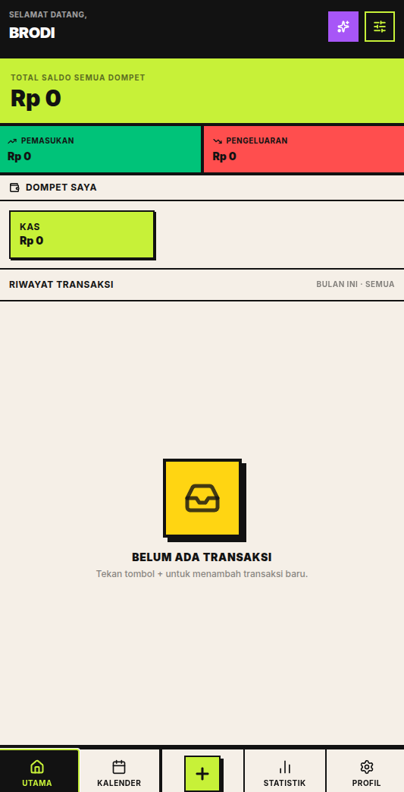

# Kanti Arta — Asisten Keuangan Pribadi (Offline-First & AI-Powered)

<p align="center">
  <!-- Ganti URL logo dengan path logo Anda -->
  
</p>

<p align="center">
  <b>Kanti Arta</b> adalah aplikasi asisten keuangan pribadi modern yang mengusung tema desain <b>Neo-Brutalisme</b> yang berani dan kontras tinggi. Didesain dengan prinsip <i>offline-first</i>, Kanti Arta menyimpan seluruh data Anda secara lokal di IndexedDB dan dilengkapi asisten pintar bertenaga AI untuk memudahkan pencatatan transaksi melalui bahasa sehari-hari.
</p>

---

## Tampilan Aplikasi (Screenshots)

<p align="right">
  <!-- Ganti path gambar di bawah dengan screenshot aplikasi Anda -->
  
</p>

---

## Fitur Utama

- **Offline-First Storage**: Data transaksi, dompet, kategori, dan anggaran disimpan langsung di browser pengguna menggunakan IndexedDB (Dexie.js).
- **AI Financial Assistant (Kanti Arta)**: Chatbot interaktif bertenaga Gemini AI untuk mencatat transaksi secara otomatis, menganalisis pola pengeluaran mingguan, dan memberikan saran finansial.
- **Konfirmasi Transaksi Terkontrol**: Setiap proposal pencatatan dari AI wajib divalidasi pengguna melalui tombol **Setuju**, **Batal**, atau opsi **Edit Manual** sebelum ditulis ke database lokal.
- **Pemindai Struk Belanja (Receipt Scanner)**: Ambil foto struk belanja Anda untuk diproses oleh AI secara otomatis menjadi nominal pengeluaran dan daftar detail item.
- **Pengelolaan Dompet & Kategori**: Kelola saldo dari beberapa rekening atau kas fisik (multi-wallet) dan kustomisasi kategori transaksi secara mandiri.
- **Batas Anggaran (Budgeting)**: Atur alokasi anggaran bulanan per kategori dan dapatkan peringatan visual instan jika pengeluaran mendekati batas limit.
- **Statistik & Kalender Transaksi**: Analisis tren keuangan dengan grafik statistik serta pantau aktivitas pencatatan harian secara visual melalui tata letak kalender transaksi.
- **Cadangan Data (Backup & Restore)**: Ekspor dan impor data keuangan Anda kapan saja dalam bentuk file JSON lokal secara instan (dukungan sinkronisasi otomatis ke server database sedang dalam tahap pengembangan/ongoing).

---

## Tech Stack

- **Framework & Build Tools:** React 19, TypeScript, Vite
- **Database Lokal:** Dexie.js (IndexedDB Wrapper)
- **Styling:** Tailwind CSS (dikustomisasi dengan tema *Brutal-Press* & bayangan tebal ala Neo-Brutalisme)
- **Icons:** Lucide React

---

## Struktur Proyek

```text
finance-m/
├── docs/                      # Dokumentasi teknis & spesifikasi API
├── public/                    # Aset statis aplikasi (logo, ikon)
├── src/
│   ├── components/            # Komponen berdasarkan Atomic Design
│   │   ├── atoms/             # Komponen terkecil (Button, Input, EmptyState)
│   │   ├── molecules/         # Komponen gabungan (MessageBubble, ScannerOverlay)
│   │   ├── organisms/         # Struktur kompleks (AddTransactionForm, WalletList)
│   │   └── templates/         # Tata letak layar utama (FormPageTemplate)
│   ├── config.ts              # Konfigurasi global & API endpoint
│   ├── db/
│   │   └── db.ts              # Skema IndexedDB (Dexie) & data benih (seed)
│   ├── hooks/                 # State management & React Custom Hooks
│   │   ├── useChatHistory.ts  # Logika percakapan asisten Fin
│   │   ├── useWallets.ts      # Logika manajemen dompet & saldo
│   │   └── useTransactions.ts # Logika rekam/sunting transaksi lokal
│   ├── lib/
│   │   ├── apiClient.ts       # Centralized Fetch API Client Wrapper
│   │   └── ai/
│   │       ├── contextAggregator.ts # Pruning payload token AI
│   │       └── intentDispatcher.ts  # Eksekutor tindakan / action intent AI
│   ├── pages/                 # Halaman navigasi (Auth, Dashboard, AI Chat, dsb)
│   ├── repositories/          # Layer abstraksi database IndexedDB
│   ├── types/                 # Definisi tipe data TypeScript
│   └── utils/
│       ├── aiParser.ts        # Regex parser transaksi bahasa Indonesia
│       └── utils.ts           # Format mata uang & styling helper
├── tailwind.config.js
└── vite.config.ts
```

---

## Panduan Memulai (Quick Start)

### 1. Prasyarat
Pastikan Anda sudah menginstal:
- **Node.js** (versi 18+) atau **Bun**
- **pnpm** (direkomendasikan untuk manajemen paket)

### 2. Konfigurasi Endpoint API
Aplikasi ini memerlukan API backend berjalan untuk menggunakan fitur AI Chat, Pemindaian Struk, dan Sinkronisasi Data.
- Konfigurasi URL API dasar dapat diatur melalui file `.env` (menggunakan `VITE_API_URL`) atau langsung melalui file [`src/config.ts`](src/config.ts).

### 3. Instalasi dan Menjalankan Aplikasi
1. Instal semua dependensi:
   ```bash
   pnpm install
   ```
2. Jalankan server pengembangan lokal:
   ```bash
   pnpm run dev
   ```
3. Buka browser pada tautan `http://localhost:3000`.

---

## Lisensi

Proyek ini dilisensikan di bawah lisensi **MIT License** - lihat file [LICENSE](LICENSE) untuk detail lebih lanjut.
